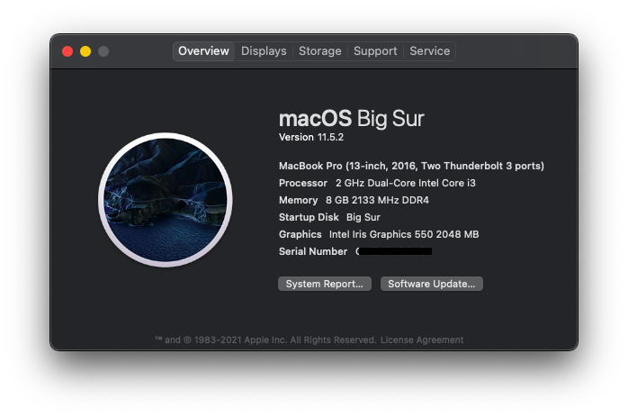

# Hackintosh on Lenovo Ideapad 320-14isk

## About this Laptop 💻
Type | Spec | Status 
:---------|:---------|:----------
Computer		| Lenovo Ideapad 320-14ISK    | Working 
BIOS Version	| LENOVO Insyde EFI(4WCN29WW) | Working 
CPU				| DualCore Intel Core i3, 2000 MHz (20 x 100) | Working 
Chipset			| Intel Sunrise Point-LP, Intel Skylake-U | Working 
Graphics		| Intel HD Graphics 520, Disable NVIDIA GeForce 920MX (Using Intel GPU only) | Working 
Audio			| Realtek ALC3240, Codec ID:10EC0230h / 17AA3809h | Working 
Ethernet		| Realtek RTL8168/8111 PCI-E Gigabit Ethernet Adapter() | Working 
WiFi			| Intel(R) Dual Band Wireless-AC 3165 | Working 
Bluetooth		| Intel(R) Wireless Bluetooth(R) | Working 
Touchpad		| I2C ELAN0608 | Working 
Keyboard		| - | Working 
Webcam		    | - | Working 
Battery		    | Serial Number: L16M2PB2- 1229 Manufacturer: SMP Device Name:	L16M2PB2 | Working 
